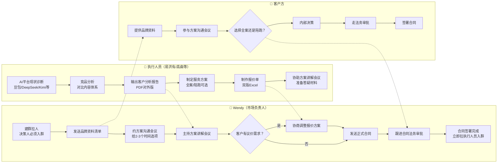
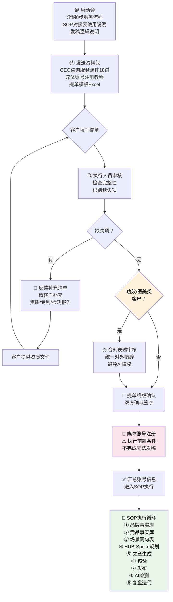
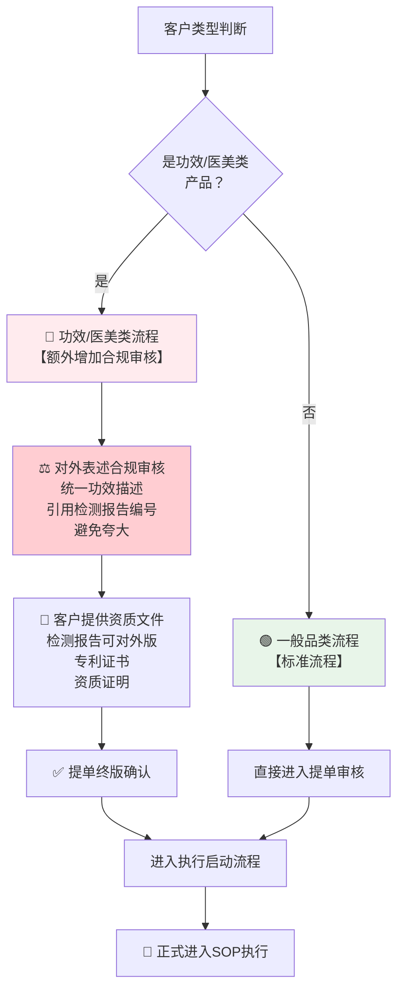
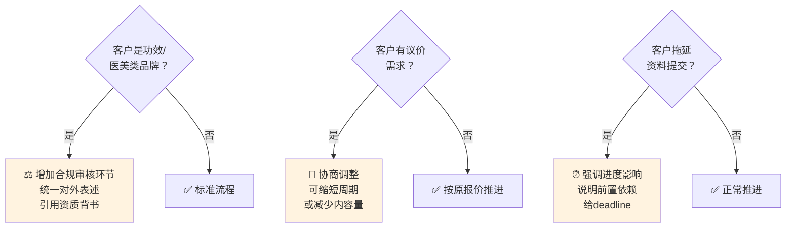
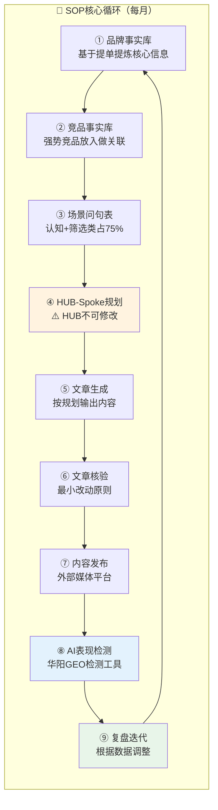

# GEO客户对接流程图

> 版本：v1.0 | 日期：2026-04-18
> 支持工具：Typora / Mark Text / GitLab / GitHub / Mermaid Live Editor 等均支持直接渲染

---

## 一、完整对接总流程图

```mermaid
flowchart TD
    subgraph 签单前["📋 签单前：商务对接"]
        A1["🔵 建群拉人\nWendy建群，客户决策人入群"] --> A2["📂 收集品牌资料\n品牌画册、产品手册、宣传材料"]
        A2 --> A3["🔍 AI平台现状诊断\n各主流AI平台曝光度调研"]
        A3 --> A4["📄 输出客户分析报告\n华阳GEO-客户名-客户分析.pdf"]
        A4 --> A5["📝 制定方案+双版报价\n全案服务 & 陪跑服务"]
        A5 --> A6["📤 发送报告+方案+报价\n飞书文档需提前开放权限"]
        A6 --> A7["💬 方案讲解会议\n线上会议，30分钟"]
        A7 --> A8{"客户确认方案？"}
        A8 -- 否 --> A9["❓ 议价/调整\n讨论修改方向"]
        A9 --> A7
        A8 -- 是 --> A10["✍️ 合同签署\n客户法务审批流程"]
        A10 --> A11["✅ 合同签署完成"]
    end

    subgraph 签单后["🚀 签单后：执行启动"]
        A11 --> B1["📹 项目启动会\n视频会议，介绍8步流程+ SOP对接表"]
        B1 --> B2["📦 发送资料包\n课件18讲 + 媒体账号注册教程 + 提单模板"]
        B2 --> B3["📋 客户填写提单\n腾讯文档在线填写"]
        B3 --> B4["🔎 我方审核提单\n反馈补充项：资质/专利/检测报告"]
        B4 --> B5{"客户补充齐全？"]
        B5 -- 否 --> B6["📨 客户提交资质文件\n检测报告/专利文件/宣传图"]
        B6 --> B4
        B5 -- 是 --> B7["⚖️ 对外表述合规审核\n功效/医美类必做"]
        B7 --> B8["📌 提单终版确认\n双方签字确认"]
        B8 --> B9["🔑 媒体账号注册\n客户注册外部媒体平台\n⚠️ 执行前置条件"]
        B9 --> B10["🎯 进入SOP执行\n事实库→竞品库→问句表→HUB→文章→发布→检测→迭代"]
    end

    style A1 fill:#e1f5fe
    style A8 fill:#fff3e0
    style A10 fill:#fff3e0
    style B9 fill:#fce4ec
    style B10 fill:#e8f5e9
```

---

## 二、签单前详细流程（按角色分工）



---

## 三、签单后执行启动流程



---

## 四、两类客户分支流程



---

## 五、关键决策点速查



---

## 六、SOP执行核心循环



---

## 使用说明

本流程图使用 **Mermaid** 语法编写，支持以下工具直接渲染：

| 工具 | 支持情况 |
|------|----------|
| Typora | ✅ 直接渲染 |
| Mark Text | ✅ 直接渲染 |
| VS Code（Mermaid插件） | ✅ 预览 |
| GitHub / GitLab | ✅ 直接渲染 |
| Mermaid Live Editor | ✅ 在线预览 |
| Notion | ✅ 需插入代码块 |
| Obsidian | ✅ 需安装Mermaid插件 |

如需导出为图片，可复制到 [Mermaid Live Editor](https://mermaid.live) 后点击 **Actions → PNG** 导出。
